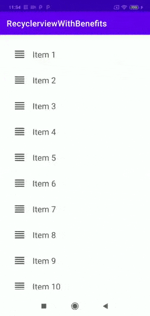

# RecyclerviewWithBenefits
This is a demo app designed for developers to show how to implement complex features like reorder, swipe, and more using recyclerview. It was created using the androidx recyclerview library and no third-party libraries are included.

The master branch includes following features:
1. Drag and Reorder Recyclerview Items.

# Drag and Reorder Recyclerview Items.
Medium article explaing the implementation is under construction, will update here once it got published.

