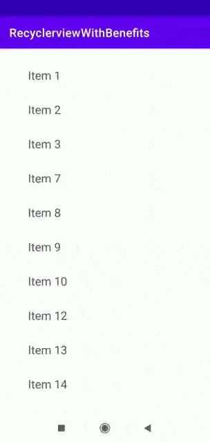

# RecyclerviewWithBenefits
This is a demo app designed for developers to show how to implement complex features like reorder, swipe, and more using recyclerview. It was created using the androidx recyclerview library and no third-party libraries are included.

The master branch includes following features:
1. Drag and Reorder Recyclerview Items.
2. Swipe to dismiss Recyclerview Items.

# Drag and Reorder Recyclerview Items.
You can find the detailed documentation about the code from [here](https://medium.com/better-programming/drag-to-reorder-android-recyclerview-items-using-kotlin-afcaee1b7fb5)

# Swipe to dismiss Recyclerview Items.
I'll post the link to the article explaing the code once it got published.

